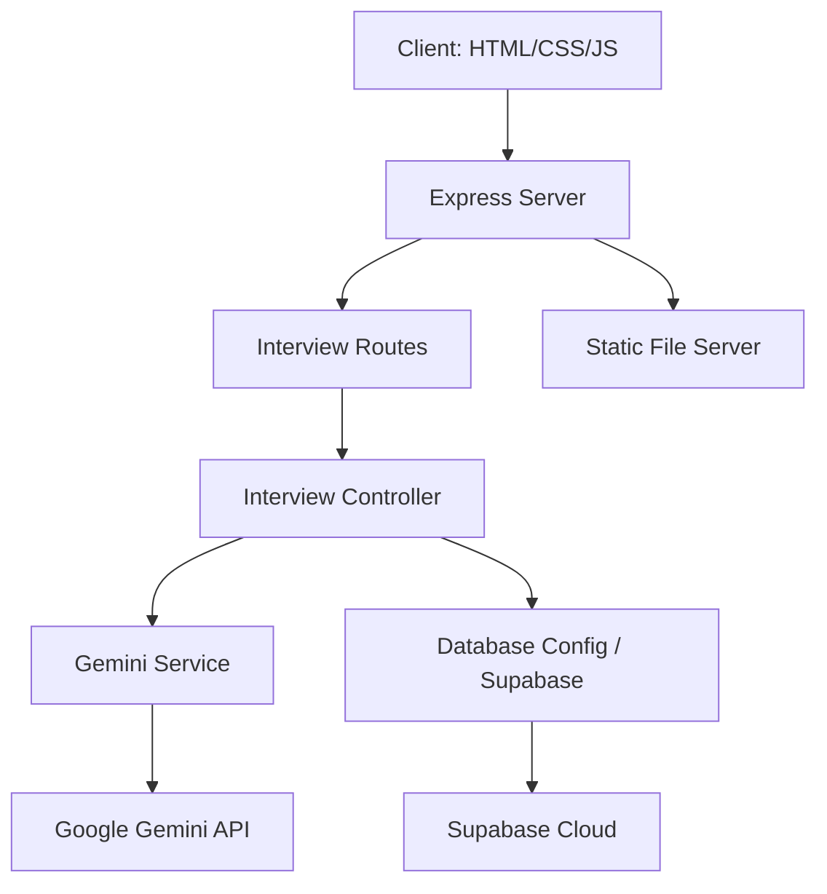

# 🤖 PrepBot – AI Interview Assistant

<<<<<<< HEAD
🚀 **PrepBot** is a state-of-the-art, AI-driven platform designed to transform how candidates prepare for professional, academic, and technical interviews. By leveraging advanced Natural Language Processing (NLP) through Google Gemini and sophisticated voice analysis, PrepBot provides a realistic, adaptive, and highly personalized interview experience.

---
=======
<p align="center">
🚀 AI-Powered Interview Simulation | Text & Voice | STAR Method Evaluation | Adaptive Questioning
</p>
   
<hr>
>>>>>>> edc95616e2bb25ea5a28db5af7fdd9ead6080572

## 📑 Table of Contents
1. [Project Vision & Overview](#-project-vision--overview)
2. [Target Audience](#-target-audience)
3. [Key Features](#-key-features)
4. [Deep Dive: Technology Stack](#-deep-dive-technology-stack)
5. [System Architecture](#-system-architecture)
6. [Backend Infrastructure (Deep Dive)](#-backend-infrastructure-deep-dive)
   - [Server Configuration](#server-configuration)
   - [API Endpoints](#api-endpoints)
   - [Database Schema & Supabase Integration](#database-schema--supabase-integration)
   - [Gemini AI Integration Logic](#gemini-ai-integration-logic)
7. [Frontend Architecture (Deep Dive)](#-frontend-architecture-deep-dive)
   - [State Management](#state-management)
   - [Voice Recognition & Analysis](#voice-recognition--analysis)
   - [Resume Parsing Pipeline](#resume-parsing-pipeline)
   - [Dynamic UI & Analytics](#dynamic-ui--analytics)
8. [Installation & Setup Guide](#-installation--setup-guide)
9. [Environment Variables](#-environment-variables)
10. [Deployment (Vercel & Beyond)](#-deployment-vercel--beyond)
11. [Future Roadmap](#-future-roadmap)
12. [Author & Contributions](#-author--contributions)

---

## 📌 Project Vision & Overview
In today’s competitive job market, technical skills are only half the battle. The ability to articulate experiences, structure answers logically (using methods like STAR), and maintain confidence is what sets top candidates apart. 

**PrepBot** was born from the need for a "living" interview companion. Unlike static question banks, PrepBot listens, adapts, and evaluates. It simulates the pressure of a real interview while providing the safety of a learning environment.

### Core Objectives:
- **Simulate Realism:** Provide a flow that mimics actual HR and technical rounds.
- **Adaptive Learning:** Ensure no two interviews are the same by using AI to generate follow-up questions based on candidate responses.
- **Actionable Analytics:** Move beyond "pass/fail" to provide granular feedback on strengths, weaknesses, and speech patterns.

---

## 🎯 Target Audience
PrepBot is architected to serve a wide spectrum of users:
- 🎓 **Students & Freshers:** Building foundational confidence for technical and behavioral rounds.
- 💼 **Professionals:** Practicing for high-stakes leadership or specialized roles (Product Management, Marketing, etc.).
- 🏫 **Academic Candidates:** Simulating interviews for teaching, research, and administrative positions.
- 🚀 **Program Applicants:** Tailored practice for specific fellowships (Google DSC, Microsoft Learn, etc.).

---

## 🔥 Key Features

### 1. Intelligent Role-Based Simulation
PrepBot understands the nuances of different roles. Whether you are a **Full Stack Developer** or a **Marketing Strategist**, the system generates specific question sets tailored to the industry standards.

### 2. AI-Powered Resume Analysis
Upload a PDF resume, and PrepBot's backend uses `pdf-parse` and Gemini AI to:
- Extract technical skills.
- Identify key projects.
- Generate **5 personalized interview questions** that an actual recruiter would ask based on your background.

### 3. Adaptive Questioning (AI Follow-ups)
The system doesn't just stick to a script. If your answer mentions a specific technology or a team conflict, the AI-driven **Smart Follow-up Generator** will inject a relevant "Tell me more about..." or "How did you handle the technical debt in that scenario?" question.

### 4. Voice Analysis & Speech-to-Text
Integrating the **Web Speech API**, PrepBot analyzes your verbal performance:
- **Filler Word Detection:** Tracks "um", "uh", "basically", and "literally".
- **Pacing Analysis:** Evaluates if you are speaking too fast or being too concise.
- **Real-time Transcription:** Converts your voice into text for AI evaluation.

### 5. STAR Method Evaluation
AI evaluates your answers based on the **Situation, Task, Action, and Result** framework, ensuring your responses are structured for maximum impact.

### 6. Comprehensive Analytics Dashboard
Using **Chart.js**, users can track their progress over multiple sessions. The dashboard displays:
- Average scores over time.
- Top recurring strengths and improvements.
- Full session history.

---

## 🛠️ Deep Dive: Technology Stack

### Frontend
- **HTML5 & CSS3:** Semantic structure with a premium, dark-mode "Glassmorphism" aesthetic.
- **Vanilla JavaScript:** For robust, lightweight state management and DOM manipulation.
- **Web Speech API:** Powering the voice-to-text and speech analysis.
- **Chart.js:** Visualizing performance metrics and historical trends.
- **PDF.js (via backend parsing):** For resume data extraction.

### Backend
- **Node.js & Express:** A scalable RESTful API architecture.
- **Multer:** Handling multipart/form-data for resume uploads.
- **PDF-Parse:** Extracting raw text from PDF files for AI processing.
- **CORS:** Enabling secure cross-origin resource sharing.

### AI & Database
- **Google Gemini AI (2.5-Flash):** The brain of the operation, handling question generation, answer evaluation, and resume analysis.
- **Supabase (PostgreSQL):** For persistent storage of interview history and user metrics.
- **Dotenv:** Secure environment variable management.

---

## ⚙️ System Architecture

PrepBot follows a **Service-Oriented Architecture (SOA)** on the backend to maintain modularity:



---

## 🚀 Backend Infrastructure (Deep Dive)

### Server Configuration (`server.js`)
The backend is the central hub. It serves the static frontend files and exposes a structured API under `/api/interview`. It includes a global error handler to ensure that AI timeouts or database disconnects don't crash the application.

### API Endpoints

| Endpoint | Method | Description |
| :--- | :--- | :--- |
| `/api/health` | `GET` | Verifies server and API status. |
| `/api/interview/start-interview` | `POST` | Generates the first question based on selected role. |
| `/api/interview/evaluate` | `POST` | Sends question, answer, and history to AI for scoring. |
| `/api/interview/upload` | `POST` | Accepts a PDF, extracts text, and returns resume-based questions. |
| `/api/interview/history` | `POST` | Saves the final interview results to Supabase. |
| `/api/interview/history` | `GET` | Retrieves all past interview sessions for the dashboard. |

### Database Schema & Supabase Integration
PrepBot uses a schema designed for analytical tracking. The `interviews` table stores:
- `role`: The targeted job title.
- `score`: The average score (0-10) of the session.
- `strengths`: A JSON array of positive feedback.
- `improvements`: A JSON array of areas for growth.
- `created_at`: Automatic timestamping.

### Gemini AI Integration Logic (`gemini.service.js`)
The service layer implements sophisticated prompting strategies:
- **Role System Prompting:** Sets the "personality" of the AI as an expert HR interviewer.
- **JSON Enforcement:** Forces Gemini to return structured data to ensure frontend stability.
- **Context Injection:** Passes previous conversation history to ensure follow-up questions are logically connected.

---

## 🎨 Frontend Architecture (Deep Dive)

### State Management (`script.js`)
The frontend maintains a complex state object that tracks:
- `currentQuestionIndex`: Navigating the 15+ question flow.
- `interviewHistory`: Accumulating the conversation for the "Final Round" evaluation.
- `normalScores` vs `finalScores`: Separating standard questions from high-pressure behavioral rounds.

### Voice Recognition & Analysis
The voice module uses an interactive listener. When a user speaks, it:
1.  **Transcribes** in real-time to the UI.
2.  **Analyzes** the string for filler words using a regex-based pattern matcher.
3.  **Appends** voice-specific feedback (e.g., "Good clarity" or "Too many pauses") to the final AI evaluation.

### Resume Parsing Pipeline
1.  User selects a PDF.
2.  Frontend sends a `FormData` object to the backend.
3.  Backend extracts text, sends it to Gemini for skill extraction.
4.  Gemini returns a JSON object with personalized questions.
5.  Frontend "injects" these questions into the primary interview loop.

---

## 🛠️ Installation & Setup Guide

### Prerequisites
- **Node.js** (v16 or higher)
- **NPM** (v8 or higher)
- **Google Gemini API Key**
- **Supabase Project** (Optional for local testing)

### 1. Clone the Repository
```bash
git clone https://github.com/yourusername/PrepBot.git
cd PrepBot-Ai-Interview-Assistant
```

### 2. Install Dependencies
```bash
# Install backend and root dependencies
npm install
```

### 3. Setup Environment Variables
Create a `.env` file in the root directory:
```env
PORT=5000
GEMINI_API_KEY=your_gemini_api_key_here
SUPABASE_URL=your_supabase_url_here
SUPABASE_KEY=your_supabase_anon_key_here
```

### 4. Run the Application
```bash
# Start the server (Backend and Frontend)
npm start
```
The application will be available at `http://localhost:5000`.

---

## 🌐 Deployment (Vercel & Beyond)

PrepBot is optimized for **Vercel** deployment.
- The `vercel.json` configuration ensures that API routes and static files are handled correctly.
- All frontend assets are served from the `/frontend` directory.
- Ensure that `API_BASE_URL` in `script.js` is updated to your production URL if deploying separately.

---

## 📅 Future Roadmap
- [ ] **Video Analysis:** Using Computer Vision to analyze eye contact and posture.
- [ ] **Multi-Language Support:** Interviews in Hindi, Spanish, Mandarin, etc.
- [ ] **Peer Comparison:** Benchmarking your score against other candidates for the same role.
- [ ] **Direct Job Matching:** Connecting high-scoring candidates with real recruitment partners.

---

## 👨‍💻 Author
**Tejaswy**
🎓 CSE Student | 💻 Full-Stack Developer | 🚀 Passionate about AI & EdTech

---

## ⭐ Final Note
PrepBot is more than just a project; it's a tool designed to empower. By bridging the gap between "knowing" and "showing," PrepBot helps you land your dream job.

**If you find this project useful, please give it a star on GitHub!** 🌟

---
*Created with ❤️ by the PrepBot Team.*
